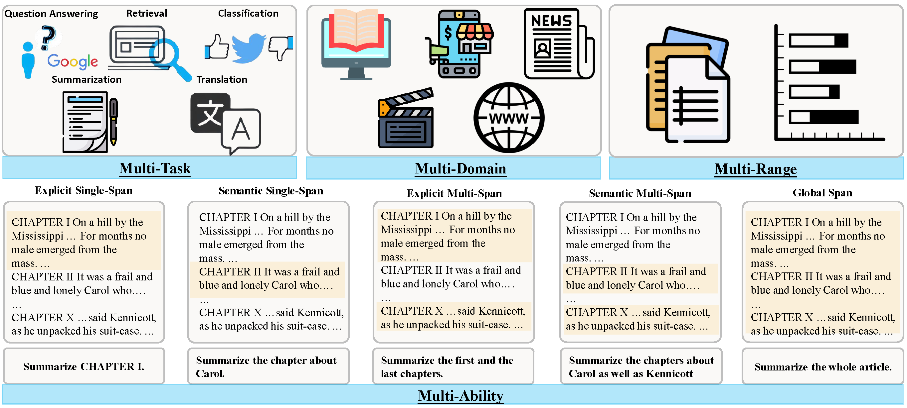
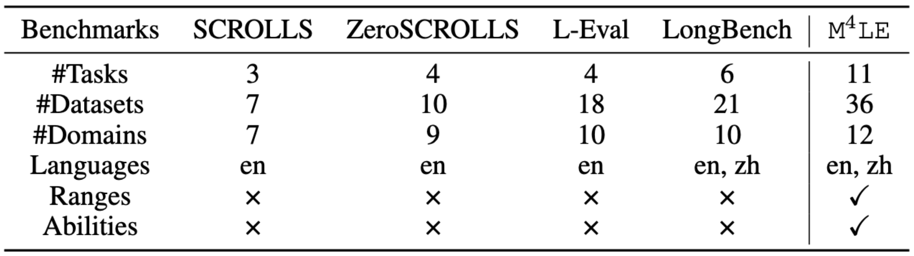
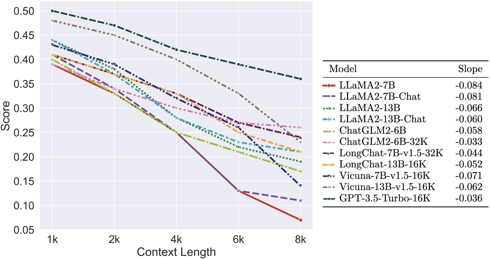

# M4LE: A Multi-Ability Multi-Range Multi-Task Multi-Domain Long-Context Evaluation Benchmark for Large Language Models

<div align="center">
  
  

<br>
<a href="https://arxiv.org/abs/2310.19240">
  <strong>📃 Paper</strong>
</a>
• <a href="https://huggingface.co/datasets/wckwan/M4LE">
  <strong>🤗 Dataset</strong>
</a></div>

--------------------------------------------------------------------------------

## 📢 Update

**[2024/07/27]** We released the dataset that supports up to 128K. We also released the code for constructing the test instances. See [5.2\. Data Creation](#data_creation) for more details.  
**[2024/05/16]** Our paper is accepted to ACL 2024 main.  
**[2023/10/31]** We released the [M4LE paper](https://arxiv.org/abs/2310.19240).

--------------------------------------------------------------------------------
<span id="content"></span>

## 📚 Content

- [1\. Introduction](#introduction)
- [2\. Leaderboard](#leaderboard)
- [3\. Results](#results)
- [4\. Setup](#setup)
- [5\. Data](#data)
    - [5.1\. Load Data](#load_data)
    - [5.2\. Data Creation](#data_creation)
- [6\. Task](#task)
- [7\. Inference](#inference)
- [8\. Evaluation](#evaluation)
- [Citation](#citation)

--------------------------------------------------------------------------------

<span id="introduction"></span>

## 📘 1\. Introduction [[Back to Top]](#content)

 **M4LE** is a **M**ulti-ability, **M**ulti-range, **M**ulti-task, bilingual benchmark for long-context evaluation. We categorize long-context understanding into five distinct abilities by considering whether it is required to identify single or multiple spans in long contexts based on explicit or semantic hints. Specifically, these abilities are explicit single-span, semantic single-span, explicit multiple-span, semantic multiple-span, and global. Different from previous long-context benchmarks that simply compile from a set of existing long NLP benchmarks, we introduce an automated method to transform short-sequence tasks into a comprehensive long-sequence scenario encompassing all these capabilities.

M4LE consists of 36 tasks, covering 11 task types and 12 domains. For each task, we construct 200 instances for each context length bucket (1K, 2K, 4K, 6K, 8K, 12K, 16K, 24K, 32K). Due to computation and cost constraints, our paper evaluated 11 well-established LLMs on instances up to the 8K context length bucket. For more details, please refer to the paper.

<div align="center">
    <br><figcaption>This figure compres M4LE with existing long-context benchmarks. </figcaption></div>

--------------------------------------------------------------------------------

<span id="leaderboard"></span>

## 🏆 2\. Leaderboard [[Back to Top]](#content)

For each task, the score is normalized by the score of GPT-3.5-Turbo-16K on the 1K context. The equation for normalization can be found in the paper. We use the average normalized score obtained from context length buckets of 1K, 2K, 4K, 6K, and 8K to compare different models.

**Model**            | **1k** | **2k** | **4k** | **6k** | **8k** | **Avg. Score**
-------------------- | :----: | :----: | :----: | :----: | :----: | :------------:
GPT-3.5-Turbo-16K    |  0.50  |  0.47  |  0.42  |  0.39  |  0.36  |      0.43
Vicuna-13B-v1.5-16K  |  0.48  |  0.45  |  0.40  |  0.33  |  0.23  |      0.38
LongChat-7B-v1.5-32K |  0.41  |  0.37  |  0.33  |  0.27  |  0.24  |      0.32
LongChat-13B-16K     |  0.41  |  0.37  |  0.33  |  0.25  |  0.21  |      0.31
ChatGLM2-6B-32K      |  0.39  |  0.34  |  0.30  |  0.27  |  0.26  |      0.31
Vicuna-7B-v1.5-16K   |  0.43  |  0.39  |  0.32  |  0.26  |  0.14  |      0.31
LLaMA2-13B-Chat      |  0.44  |  0.37  |  0.28  |  0.23  |  0.21  |      0.31
LLaMA2-13B           |  0.44  |  0.38  |  0.28  |  0.22  |  0.19  |      0.30
ChatGLM2-6B          |  0.40  |  0.33  |  0.25  |  0.21  |  0.17  |      0.27
LLaMA2-7B-Chat       |  0.41  |  0.34  |  0.25  |  0.13  |  0.11  |      0.25
LLaMA2-7B            |  0.39  |  0.33  |  0.25  |  0.13  |  0.07  |      0.23

--------------------------------------------------------------------------------

<span id="results"></span>

## 📊 3\. Results [[Back to Top]](#content) 

<!--  -->

 <div align="center">
    <br><figcaption>The normalized scores of various models in different context lengths (left), accompanied by the slopes of the corresponding best-fit lines (right).</figcaption></div>

--------------------------------------------------------------------------------

<span id="setup"></span>

## 🛠 4\.️ Setup [[Back to Top]](#content)

The following command sets up a conda environment for inference and evaluation.

```bash
conda env create --name m4le --file environment.yml
```

--------------------------------------------------------------------------------

<span id="data"></span>

## 🗂️ 5\. Data [[Back to Top]](#content)

<span id="load_data"></span>

### 5.1\. Load Data

As described in the paper, we adopt different open-sourced datasets to construct 36 tasks in M4LE. Each task has a `jsonl` file containing all the testing instances. You can load the data from the [huggingface hub](https://huggingface.co/datasets/wckwan/M4LE):

```python
from datasets import load_dataset
tasks = [
    "arxiv",
    "bigpatent_global_cls",
    "bigpatent_global_sum",
    "booksum",
    "c3",
    "cepsum",
    "clts+",
    "cnewsum",
    "cnnnews",
    "drcd_explicit-single",
    "drcd_semantic-single",
    "duorc",
    "dureader",
    "hotpotqa",
    "lcsts",
    "marc",
    "mnds-news_explicit-single",
    "mnds-news_explicit-multiple",
    "mnds-news_semantic-multiple",
    "ncls",
    "news-commentary-en2zh",
    "news-commentary-zh2en",
    "news2016",
    "newsqa",
    "nq-open",
    "online-shopping",
    "open-subtitles-en2zh",
    "open-subtitles-zh2en",
    "pubmed",
    "tedtalks-en2zh",
    "tedtalks-zh2en",
    "thucnews_explicit-single",
    "thucnews_explicit-multiple",
    "thucnews_semantic-multiple",
    "triviaqa",
    "wiki2019zh",
    "wikihow",
    "wikitext-103",
    "wow",
]

for task in tasks:
    data = load_dataset('wckwan/M4LE', task, split='test')
```

Each testing instance follows this format:

```yaml
{
    "instruction": "<task description>",
    "input": "<task input with one-shot example>",
    "answers": ["<answer1>", "<answer2>"],
    "input_length": <int, number of words in instruction and input separated by space>,
    "total_length": <int, number of words in instruction, input and gold answer separated by space>,
    "length_bucket": <int, the length bucket to which this instance belongs>
}
```

<span id="data_creation"></span>

### 5.2\. Data Creation

We also provide the scripts to construct the instances from the raw datasets.  
First, download and preprocess the data. It downloads many source datasets which takes lots of time and space. It is possible to encounter network errors during the download process where you have to edit the script to resume where you left off.
```bash
./raw_data/preprocess.sh
```

<details>
<summary>If the preprocessing script is successful, you should have the following folder structure</summary>

```
raw_data/
├── classification/
│   ├── THUCNews/
│   ├── arxiv-dataset/
│   ├── marc/
│   └── online_shopping_10_cats/
├── nli/
│   ├── wiki_zh/
│   └── wikitext-2-raw/
├── qa/
│   ├── DRCD/
│   ├── __MACOSX/
│   │   └── newsqa-data-v1/
│   ├── c3/
│   ├── duorc/
│   │   ├── dataset/
│   │   └── preprocessing/
│   │       ├── data/
│   │       └── utils/
│   ├── dureader/
│   │   ├── devset/
│   │   ├── evaluation_metric/
│   │   ├── testset/
│   │   └── trainset/
│   ├── hotpotqa/
│   ├── natural_questions/
│   ├── newsqa/
│   │   └── stories/
│   └── triviaqa/
│       ├── evidence/
│       │   ├── web/
│       │   └── wikipedia/
│       ├── qa/
│       └── triviaqa-unfiltered/
├── summarization/
│   ├── CEPSUM/
│   ├── CNewSum_v2/
│   │   └── final/
│   ├── NCLS-Data/
│   │   ├── EN2ZHSUM/
│   │   └── ZH2ENSUM/
│   ├── QMSum/
│   │   ├── data/
│   │   │   ├── ALL/
│   │   │   ├── Academic/
│   │   │   ├── Committee/
│   │   │   └── Product/
│   │   ├── extracted_span/
│   │   ├── figures/
│   │   └── model_output/
│   ├── arxiv-dataset/
│   ├── bigPatentData/
│   │   ├── test/
│   │   ├── train/
│   │   └── val/
│   ├── clts/
│   ├── cnn/
│   │   └── stories/
│   ├── gov-report/
│   │   ├── crs/
│   │   ├── gao/
│   │   └── split_ids/
│   ├── lcsts/
│   ├── news2016zh/
│   ├── pubmed-dataset/
│   └── wikihow/
├── translation/
│   ├── News-Commentary_v16/
│   │   ├── en/
│   │   │   └── News-Commentary/
│   │   │       └── xml/
│   │   │           └── en/
│   │   └── zh/
│   │       └── News-Commentary/
│   │           └── xml/
│   │               └── zh/
│   ├── opensubtitles/
│   │   └── OpenSubtitles/
│   │       └── xml/
│   │           ├── en/
│   │           ├── zh_cn/
│   └── tedtalk/
└── wow/
```
</details>


Construct the test instances with the following script. To customize the length buckets, edit the variable `buckets` in `create_data.sh`
```bash
./data/create_data.sh
```

--------------------------------------------------------------------------------

<span id="task"></span>

## 📝 6\. Task [[Back to Top]](#content)

Ability           | Task Name                                   | Task Type  | Language | Description
----------------- | ------------------------------------------- | ---------- | -------- | ------------------------------------------------------------------
Explicit Single   | mnds-news_explicit-single                   | CLS + RET  | En       | Classify a specified news article.
Explicit Single   | thucnews_explicit-single                    | CLS + RET  | Zh       | Classify a specified news article.
Explicit Single   | newsqa                                      | QA + RET   | En       | Answer a question based on a specified news article.
Explicit Single   | c3                                          | QA + RET   | Zh       | Answer a multi-choice question based on a textbook extract.
Explicit Single   | wow                                         | RET        | En       | Return the ID of the article related to a specified topic.
Explicit Single   | drcd_explicit-single                        | RET        | Zh       | Return the ID of the article related to a specified topic.
Explicit Single   | cnnnews                                     | SUM + RET  | En       | Summarize a specified news article.
Explicit Single   | cepsum                                      | SUM + RET  | Zh       | Summarize a specified product description.
Explicit Single   | lcsts                                       | SUM + RET  | Zh       | Summarize a specified news article.
Explicit Single   | ncls                                        | SUM + RET  | En, Zh   | Summarize a specified news article.
Explicit Multiple | mnds-news_explicit-multiple                 | CLS + RET  | En       | Return the IDs of all the articles belong to a specified class.
Explicit Multiple | thucnews_explicit-multiple                  | CLS + RET  | Zh       | Return the IDs of all the articles belong to a specified class.
Explicit Multiple | marc                                        | CLS + RET  | En, Zh   | Return the IDs of all the positive product reviews.
Explicit Multiple | online-shopping                             | CLS + RET  | Zh       | Return the IDs of all the positive product reviews.
Semantic Single   | wikitext-103                                | NLI + RET  | En       | Return the ID of the paragraph that continues a query paragraph.
Semantic Single   | wiki2019zh                                  | NLI + RET  | Zh       | Return the ID of the paragraph that continues a query paragraph.
Semantic Single   | duorc                                       | QA         | En       | Answer a question based on multiple movie plots.
Semantic Single   | nq-open                                     | QA         | En       | Answer a question based on multiple wikipedia paragraphs.
Semantic Single   | dureader                                    | QA         | Zh       | Answer a question based on multiple web snippets.
Semantic Single   | drcd_semantic-single                        | QA         | Zh       | Answer a question based on multiple wikipedia paragraphs.
Semantic Single   | wikihow                                     | SUM + RET  | En       | Summarize an article based on a given topic.
Semantic Single   | news2016                                    | SUM + RET  | Zh       | Summarize a news article based on a given title.
Semantic Single   | tedtalks-en2zh/tedtalks-zh2en               | TRAN + RET | En, Zh   | Translate a Ted Talk transcript based on a given title.
Semantic Multiple | mnds-news_semantic-multiple                 | CLS + CNT  | En       | Return the number of news articles belonging to a specified class.
Semantic Multiple | thucnews_semantic-multiple                  | CLS + CNT  | Zh       | Return the number of news articles belonging to a specified class.
Semantic Multiple | hotpotqa                                    | QA         | En       | Answer a question based on multiple wikipedia paragraphs.
Global            | bigpatent_global_cls                        | CLS        | En       | Classify a patent document.
Global            | triviaqa                                    | QA         | En       | Answer a question based on a web snippet.
Global            | arxiv                                       | SUM        | En       | Summarize an academic paper.
Global            | bigpatent_global_sum                        | SUM        | En       | Summarize a patent document.
Global            | pubmed                                      | SUM        | En       | Summarize a medical paper.
Global            | booksum                                     | SUM        | En       | Summarize one or more chapters of a book.
Global            | cnewsum                                     | SUM        | Zh       | Summarize a news article.
Global            | clts+                                       | SUM        | Zh       | Summarize a news article.
Global            | open-subtitles-en2zh/open-subtitles-zh2en   | TRAN       | En, Zh   | Translate the movie subtitles.
Global            | news-commentary-en2zh/news-commentary-zh2en | TRAN       | En, Zh   | Translate the movie subtitles.

--------------------------------------------------------------------------------

<span id="inference"></span>

## 🧠 7\. Inference [[Back to Top]](#content)

In the paper, we use the prompt format `f"{instruction}\n{input}"`. We recommend editing or using our `inference.py`` code. To run the code, provide the HuggingFace model name and task name:

```bash
python inference.py \
--model_path lmsys/vicuna-13b-v1.5-16k \
--task nq-open
```

For LLaMA2 models, we recommend enabling dynamic NTK scaling:

```bash
python inference.py \
--model_path meta-llama/Llama-2-7b \
--task nq-open \
--load_model_args '{"rope_scaling": {"type": "dynamic", "factor": 2.0}}'
```

Additional arguments:

- `--resume`: Specify if you wish to pick up from where you left off.
- `--api_key`: The OpenAI key if you are using OpenAI models.

The predictions will be saved at `outputs/{model}/{task}.jsonl`

--------------------------------------------------------------------------------

<span id="evaluation"></span>

## 📈 8\. Evaluation [[Back to Top]](#content)

Run the following script to evaluate:

```bash
python evaluation.py
```

It will evaluate all the models saved at `outputs/{model}/`. The results will be saved at `results/all_results.csv`, where each row contains

- `Model`: Model name.
- `Task`: Task Name.
- `Bucket`: The context length bucket.
- `Score`: The evaluation score.

--------------------------------------------------------------------------------

<span id="citation"></span>


## 📄 Citation

If you find our paper and resources useful, please consider citing our paper:

```bibtex
@misc{kwan_m4le_2023,
  title = {{{M4LE}}: {{A Multi-Ability Multi-Range Multi-Task Multi-Domain Long-Context Evaluation Benchmark}} for {{Large Language Models}}},
  author = {Kwan, Wai-Chung and Zeng, Xingshan and Wang, Yufei and Sun, Yusen and Li, Liangyou and Shang, Lifeng and Liu, Qun and Wong, Kam-Fai},
  year = {2023},
}
```
